# Bitcoin DCA Architecture

This document provides a comprehensive architecture overview of the Bitcoin DCA application, showing the interaction between smart contracts, keeper infrastructure, routing mechanisms, and user interfaces.

## System Architecture Overview

```mermaid
graph TB
    %% User Layer
    subgraph "User Interface"
        UI["Next.js Frontend"]
        Wallet["Wallet Integration<br/>RainbowKit/wagmi"]
        Safe["Safe App Mode<br/>Multisig Support"]
    end

    %% Smart Contract Layer
    subgraph "Smart Contract Layer"
        subgraph "Core Contracts"
            DCA["DcaManager<br/>UUPS Upgradeable<br/>Position Management<br/>Balance Tracking<br/>Authorization"]
            NFT["PositionNFT<br/>ERC-721<br/>Position Metadata<br/>Ownership Tracking"]
            Storage["PositionStorage<br/>Upgradeable Storage<br/>Position Data<br/>Balance Mappings"]
        end
        
        subgraph "Execution Layer"
            Exec["Executor<br/>Keeper Entrypoint<br/>Guard Enforcement<br/>Route Selection<br/>Accounting Updates"]
            Router["Router Adapters"]
            UniV3["UniV3Adapter<br/>Flashbots Support<br/>Private Transactions"]
            COW["CoWAdapter<br/>Partial Fills<br/>MEV Protection"]
            OneInch["OneInchAdapter<br/>Fallback Routing"]
        end
        
        subgraph "Oracle & Pricing"
            Oracle["PriceOracle<br/>Chainlink Feeds<br/>TWAP Utilities<br/>Price Validation"]
            ChainlinkBTC["Chainlink BTC/USD"]
            ChainlinkETH["Chainlink ETH/USD"]
            ChainlinkUSDC["Chainlink USDC/USD"]
            ChainlinkWBTC["Chainlink WBTC/BTC"]
        end
        
        subgraph "Fee Management"
            Treasury["Treasury<br/>2/3 Multisig<br/>Timelock<br/>Fee Collection<br/>Emergency Controls"]
        end
    end

    %% Keeper Infrastructure
    subgraph "Keeper Infrastructure"
        subgraph "Primary Keepers"
            Chainlink["Chainlink Automation<br/>checkUpkeep<br/>batchExecute<br/>Time-based Triggers"]
        end
        
        subgraph "Backup Keepers"
            Gelato["Gelato Network<br/>Mirrored Tasks<br/>Fallback Execution"]
            Public["Public Execution<br/>6h Grace Period<br/>Tip-based Incentives<br/>Griefing Protection"]
        end
    end

    %% Routing & DEX Layer
    subgraph "DEX & Routing Layer"
        subgraph "Auto Routing Logic"
            Routing["Routing Engine<br/>Notional Analysis<br/>Slippage Estimation<br/>Venue Selection"]
        end
        
        subgraph "DEX Protocols"
            UniswapV3["Uniswap V3<br/>Multiple Fee Tiers<br/>TWAP Calculations<br/>Liquidity Depth"]
            CoWProtocol["CoW Protocol<br/>Batch Auctions<br/>MEV Protection<br/>Partial Fills"]
            OneInchDEX["1inch Aggregator<br/>Multi-DEX<br/>Optimal Routes<br/>Fallback Option"]
        end
        
        subgraph "MEV Protection"
            Flashbots["Flashbots<br/>Private Transactions<br/>MEV Protection"]
        end
    end

    %% Data & Analytics
    subgraph "Data Layer"
        subgraph "On-chain Data"
            Events["Contract Events<br/>PositionCreated<br/>Executed<br/>ExecutionSkipped<br/>ExecutionDetails"]
        end
        
        subgraph "Off-chain Data"
            Subgraph["The Graph<br/>Subgraph<br/>Position History<br/>Execution Logs<br/>Analytics Data"]
            Indexing["Graph Protocol<br/>Indexing<br/>Real-time Updates<br/>Historical Data"]
        end
        
        subgraph "Analytics"
            Metrics["Analytics Dashboard<br/>Success Rates<br/>Fee Tracking<br/>Performance Metrics"]
            CSV["CSV Export<br/>Transaction History<br/>Cost Basis<br/>Route Analysis"]
        end
    end

    %% External Services
    subgraph "External Services"
        subgraph "Infrastructure"
            RPC["Ethereum RPC<br/>Alchemy/Infura<br/>Transaction Broadcasting"]
            IPFS["IPFS<br/>NFT Metadata<br/>Position Details"]
        end
        
        subgraph "Monitoring"
            Sentry["Sentry<br/>Error Tracking<br/>Frontend Monitoring"]
            PostHog["PostHog<br/>Product Analytics<br/>User Behavior"]
        end
        
        subgraph "Notifications"
            EPNS["Push Protocol<br/>Execution Alerts<br/>User Notifications"]
            Webhook["Webhook Service<br/>Custom Notifications<br/>Integration Hooks"]
        end
    end

    %% Circuit Breakers & Security
    subgraph "Security & Circuit Breakers"
        subgraph "Market Protections"
            Breakers["Circuit Breakers<br/>Daily Volume Limits<br/>Price Movement Caps<br/>Oracle Staleness"]
            Guards["Position Guards<br/>Slippage Limits<br/>Price Caps/Floors<br/>Stable Depeg Checks"]
        end
        
        subgraph "Emergency Controls"
            Pause["Emergency Pause<br/>Global Pause<br/>Asset-specific Pause<br/>Venue-specific Pause"]
            Withdraw["Emergency Withdraw<br/>7-day Delay<br/>Full Position Recovery<br/>No In-flight Swaps"]
        end
    end

    %% Connection Flows
    UI --> Wallet
    Wallet --> DCA
    Safe --> DCA
    
    DCA --> NFT
    DCA --> Storage
    DCA --> Exec
    DCA --> Treasury
    
    Exec --> Router
    Router --> UniV3
    Router --> COW
    Router --> OneInch
    
    Exec --> Oracle
    Oracle --> ChainlinkBTC
    Oracle --> ChainlinkETH
    Oracle --> ChainlinkUSDC
    Oracle --> ChainlinkWBTC
    
    Chainlink --> Exec
    Gelato --> Exec
    Public --> Exec
    
    Exec --> Routing
    Routing --> UniswapV3
    Routing --> CoWProtocol
    Routing --> OneInchDEX
    
    UniV3 --> Flashbots
    
    DCA --> Events
    Exec --> Events
    Events --> Subgraph
    Subgraph --> Indexing
    Indexing --> Metrics
    Subgraph --> CSV
    
    UI --> Subgraph
    UI --> RPC
    
    NFT --> IPFS
    
    UI --> Sentry
    UI --> PostHog
    Exec --> EPNS
    Exec --> Webhook
    
    DCA --> Breakers
    Exec --> Guards
    Breakers --> Pause
    Guards --> Withdraw
    
    %% Fee Flows
    Exec --> Treasury
    Treasury --> Chainlink
    Treasury --> Gelato

    %% Styling
    classDef userLayer fill:#e1f5fe,stroke:#01579b,stroke-width:2px
    classDef contractLayer fill:#f3e5f5,stroke:#4a148c,stroke-width:2px
    classDef keeperLayer fill:#e8f5e8,stroke:#1b5e20,stroke-width:2px
    classDef dexLayer fill:#fff3e0,stroke:#e65100,stroke-width:2px
    classDef dataLayer fill:#fce4ec,stroke:#880e4f,stroke-width:2px
    classDef externalLayer fill:#f1f8e9,stroke:#33691e,stroke-width:2px
    classDef securityLayer fill:#ffebee,stroke:#b71c1c,stroke-width:2px

    class UI,Wallet,Safe userLayer
    class DCA,NFT,Storage,Exec,Router,UniV3,COW,OneInch,Oracle,ChainlinkBTC,ChainlinkETH,ChainlinkUSDC,ChainlinkWBTC,Treasury contractLayer
    class Chainlink,Gelato,Public keeperLayer
    class Routing,UniswapV3,CoWProtocol,OneInchDEX,Flashbots dexLayer
    class Events,Subgraph,Indexing,Metrics,CSV dataLayer
    class RPC,IPFS,Sentry,PostHog,EPNS,Webhook externalLayer
    class Breakers,Guards,Pause,Withdraw securityLayer
```



## Architecture Components

### 1. Smart Contract Layer

#### Core Contracts
- **DcaManager**: Central coordinator implementing UUPS upgradeability pattern
- **PositionNFT**: ERC-721 tokens representing user positions with metadata
- **PositionStorage**: Separate upgradeable storage contract to avoid NFT logic conflicts
- **Executor**: Keeper entrypoint with guard enforcement and route selection
- **Router Adapters**: Protocol-specific adapters for different DEX integrations
- **PriceOracle**: Multi-source price feeds with Chainlink integration and TWAP utilities
- **Treasury**: Fee collection with multisig governance and timelock controls

#### Key Features
- **Upgradeability**: UUPS pattern for core contracts with separate storage
- **Non-custodial**: Users maintain control of their funds
- **Modular Design**: Pluggable router adapters for different DEX protocols
- **Security**: Circuit breakers, guards, and emergency controls

### 2. Keeper Infrastructure

#### Primary Keeper
- **Chainlink Automation**: Time-based execution with batch processing capabilities
- **checkUpkeep()**: Evaluates position eligibility and execution conditions
- **batchExecute()**: Efficient batch processing with gas optimization

#### Backup Keepers
- **Gelato Network**: Mirrored tasks for redundancy
- **Public Execution**: 6-hour grace period with tip-based incentives
- **Griefing Protection**: Cooldown mechanisms and position-specific limits

### 3. Routing & DEX Integration

#### Auto Routing Logic
- **Intelligent Routing**: Notional-based venue selection ($5k threshold)
- **MEV Protection**: Flashbots integration for private transactions
- **Fallback Mechanisms**: Multi-tier routing with CoW → UniV3 → 1inch cascade
- **Partial Fills**: CoW Protocol support for large orders

#### Supported Protocols
- **Uniswap V3**: Multiple fee tiers with TWAP calculations
- **CoW Protocol**: Batch auctions with MEV protection
- **1inch Aggregator**: Multi-DEX routing with optimal pathfinding

### 4. Security & Circuit Breakers

#### Market Protections
- **Daily Volume Limits**: $10M global cap with automatic pausing
- **Price Movement Caps**: 20% maximum price movement in 1-hour windows
- **Oracle Staleness**: 30-minute maximum staleness for price feeds
- **Stable Depeg Checks**: 1% maximum deviation from USD peg

#### Position Guards
- **Slippage Limits**: Configurable slippage protection (default 0.5%)
- **Price Caps/Floors**: BUY/SELL price protection mechanisms
- **Gas Caps**: Maximum gas price protection per position
- **TWAP Deviation**: Maximum deviation from time-weighted average price

### 5. Data & Analytics

#### On-chain Data
- **Contract Events**: Comprehensive event logging for all operations
- **Execution Details**: Extended telemetry with route information and price impact
- **Position History**: Complete audit trail of all position activities

#### Off-chain Infrastructure
- **The Graph Subgraph**: Real-time indexing of contract events
- **Analytics Dashboard**: Performance metrics and success rate tracking
- **CSV Export**: Complete transaction history with cost basis analysis

### 6. User Interface

#### Frontend Architecture
- **Next.js 15+**: React Server Components with file-based routing
- **wagmi v2 + viem**: Type-safe Web3 interactions
- **RainbowKit**: Wallet integration with WalletConnect v2 support
- **Safe App Mode**: Multisig integration for treasury management

#### Key Features
- **Strategy Wizard**: 4-step position creation process
- **Positions Dashboard**: Real-time status and performance tracking
- **Execution Logs**: Detailed transaction history with route analysis
- **Health Monitoring**: Circuit breaker status and system health indicators

## Execution Flow

### 1. Position Creation
1. User connects wallet and navigates to strategy wizard
2. Frontend validates parameters and estimates costs
3. User approves Permit2 allowances and signs position creation transaction
4. DcaManager mints PositionNFT and initializes position storage
5. Position becomes eligible for execution based on start time

### 2. Execution Cycle
1. Chainlink Automation checks position eligibility via checkUpkeep()
2. Executor validates all guards (oracle staleness, TWAP deviation, price caps)
3. Router selects optimal venue based on notional size and slippage estimates
4. Trade execution with MEV protection (Flashbots for UniV3, CoW for large orders)
5. Accounting updates with fee collection and next execution scheduling
6. Events emitted for subgraph indexing and user notifications

### 3. Position Management
1. Users can deposit/withdraw funds anytime (except during execution)
2. Position modifications limited to safe fields (slippage, venue, gas caps)
3. Emergency pause available with 7-day delayed emergency withdrawal
4. CSV export provides complete transaction history for tax reporting

## Security Considerations

### Smart Contract Security
- **Formal Verification**: Invariant checking for value conservation and fee caps
- **Audits**: Pre-mainnet audits with ongoing bug bounty program
- **Access Controls**: Role-based permissions with multisig governance
- **Reentrancy Protection**: nonReentrant modifiers on all external functions

### Operational Security
- **Circuit Breakers**: Automatic pausing on extreme market conditions
- **Oracle Security**: Multi-source price feeds with staleness checks
- **MEV Protection**: Private transaction routing and CoW Protocol integration
- **Emergency Controls**: Time-delayed emergency withdrawal mechanisms

## Smart Contract Architecture

### Smart Contract System Overview

```mermaid
graph TB
    %% User Interface Layer
    subgraph "User Interface Layer"
        User["User"]
        Frontend["Frontend App"]
        Safe["Safe Multisig"]
    end

    %% Core Contract Layer
    subgraph "Core Contracts"
        DCA["DcaManager<br/>UUPS Upgradeable<br/>Main Controller"]
        NFT["PositionNFT<br/>ERC-721<br/>Position Ownership"]
        Storage["PositionStorage<br/>Upgradeable Storage<br/>Position Data"]
    end

    %% Execution Layer
    subgraph "Execution Contracts"
        Exec["Executor<br/>Keeper Entrypoint<br/>Execution Logic"]
        Router["RouterManager<br/>Route Coordination<br/>Adapter Management"]
    end

    %% Router Adapters
    subgraph "Router Adapters"
        UniV3["UniV3Adapter<br/>Uniswap V3 Integration"]
        CoW["CoWAdapter<br/>CoW Protocol Integration"]
        OneInch["OneInchAdapter<br/>1inch Aggregator Integration"]
    end

    %% Oracle & Pricing
    subgraph "Oracle System"
        Oracle["PriceOracle<br/>Price Aggregation<br/>TWAP Calculations"]
        ChainlinkBTC["Chainlink BTC/USD"]
        ChainlinkETH["Chainlink ETH/USD"]
        ChainlinkUSDC["Chainlink USDC/USD"]
        ChainlinkWBTC["Chainlink WBTC/BTC"]
        UniV3TWAP["Uniswap V3 TWAP"]
    end

    %% Fee Management
    subgraph "Fee Management"
        Treasury["Treasury<br/>Fee Collection<br/>2/3 Multisig"]
        FeeConfig["FeeConfiguration<br/>Dynamic Fee Settings"]
    end

    %% External DEX Protocols
    subgraph "External DEX Protocols"
        UniswapV3["Uniswap V3<br/>DEX Protocol"]
        CoWProtocol["CoW Protocol<br/>MEV Protection"]
        OneInchDEX["1inch Network<br/>Aggregator"]
    end

    %% Keeper Infrastructure
    subgraph "Keeper Infrastructure"
        ChainlinkKeeper["Chainlink Automation"]
        GelatoKeeper["Gelato Network"]
        PublicKeeper["Public Execution"]
    end

    %% Token Contracts
    subgraph "Token Contracts"
        WBTC["WBTC<br/>Wrapped Bitcoin"]
        USDC["USDC<br/>USD Coin"]
        USDT["USDT<br/>Tether"]
        DAI["DAI<br/>Dai Stablecoin"]
        WETH["WETH<br/>Wrapped Ether"]
    end

    %% Connections - User Layer
    User --> Frontend
    Safe --> Frontend
    Frontend --> DCA

    %% Connections - Core Contracts
    DCA --> NFT
    DCA --> Storage
    DCA --> Exec
    DCA --> Treasury
    DCA --> Router

    %% Connections - Execution Layer
    Exec --> Router
    Exec --> Oracle
    Router --> UniV3
    Router --> CoW
    Router --> OneInch

    %% Connections - Oracle System
    Oracle --> ChainlinkBTC
    Oracle --> ChainlinkETH
    Oracle --> ChainlinkUSDC
    Oracle --> ChainlinkWBTC
    Oracle --> UniV3TWAP

    %% Connections - Router Adapters to DEX
    UniV3 --> UniswapV3
    CoW --> CoWProtocol
    OneInch --> OneInchDEX

    %% Connections - Keeper Infrastructure
    ChainlinkKeeper --> Exec
    GelatoKeeper --> Exec
    PublicKeeper --> Exec

    %% Connections - Token Interactions
    DCA --> WBTC
    DCA --> USDC
    DCA --> USDT
    DCA --> DAI
    DCA --> WETH

    %% Fee Configuration
    Treasury --> FeeConfig
    FeeConfig --> DCA

    %% Styling
    classDef userLayer fill:#e3f2fd,stroke:#1976d2,stroke-width:2px
    classDef coreLayer fill:#f3e5f5,stroke:#7b1fa2,stroke-width:2px
    classDef executionLayer fill:#e8f5e8,stroke:#388e3c,stroke-width:2px
    classDef adapterLayer fill:#fff3e0,stroke:#f57c00,stroke-width:2px
    classDef oracleLayer fill:#fce4ec,stroke:#c2185b,stroke-width:2px
    classDef feeLayer fill:#f1f8e9,stroke:#689f38,stroke-width:2px
    classDef externalLayer fill:#ffebee,stroke:#d32f2f,stroke-width:2px
    classDef keeperLayer fill:#e0f2f1,stroke:#00695c,stroke-width:2px
    classDef tokenLayer fill:#f3e5f5,stroke:#512da8,stroke-width:2px

    class User,Frontend,Safe userLayer
    class DCA,NFT,Storage coreLayer
    class Exec,Router executionLayer
    class UniV3,CoW,OneInch adapterLayer
    class Oracle,ChainlinkBTC,ChainlinkETH,ChainlinkUSDC,ChainlinkWBTC,UniV3TWAP oracleLayer
    class Treasury,FeeConfig feeLayer
    class UniswapV3,CoWProtocol,OneInchDEX externalLayer
    class ChainlinkKeeper,GelatoKeeper,PublicKeeper keeperLayer
    class WBTC,USDC,USDT,DAI,WETH tokenLayer
```



### Smart Contract API Reference

#### 1. DcaManager (UUPS Upgradeable)

**Inheritance**: `UUPSUpgradeable`, `AccessControl`, `ReentrancyGuard`, `Pausable`

**OpenZeppelin Dependencies**:
- `@openzeppelin/contracts-upgradeable/proxy/utils/UUPSUpgradeable.sol`
- `@openzeppelin/contracts-upgradeable/access/AccessControl.sol`
- `@openzeppelin/contracts-upgradeable/security/ReentrancyGuard.sol`
- `@openzeppelin/contracts-upgradeable/security/Pausable.sol`

##### Core Position Management

```solidity
// Position Creation
function createPosition(CreatePositionParams calldata params) 
    external 
    nonReentrant 
    whenNotPaused 
    returns (uint256 positionId)

struct CreatePositionParams {
    address owner;              // Position owner
    address beneficiary;        // Optional beneficiary (defaults to owner)
    address quoteToken;         // Quote token (USDC, DAI, USDT, etc.)
    bool isBuy;                // true = BUY (quote→WBTC), false = SELL (WBTC→quote)
    uint16 frequency;           // 0=daily, 1=weekly, 2=monthly
    uint16 venue;              // 0=AUTO, 1=UNIV3_ONLY, 2=COW_ONLY, 3=AGGREGATOR
    uint16 slippageBps;        // Slippage protection in basis points (default 50 = 0.5%)
    uint32 twapWindow;         // TWAP window in seconds (default 3600 = 1h)
    uint16 maxPriceDeviationBps; // Max deviation from TWAP (default 100 = 1%)
    uint64 startAt;            // Start timestamp (UTC)
    uint64 endAt;              // End timestamp (0 = no end)
    uint128 amountPerPeriod;   // Amount per period in token units
    uint128 priceFloorUsd;     // Minimum price for SELL (0 = no floor)
    uint128 priceCapUsd;       // Maximum price for BUY (0 = no cap)
    uint64 maxBaseFeeWei;      // Max base fee (0 = no limit)
    uint64 maxPriorityFeeWei;  // Max priority fee (0 = no limit)
    bool mevProtection;        // true = PRIVATE, false = PUBLIC
}

// Position Management
function deposit(uint256 positionId, address token, uint256 amount) 
    external 
    nonReentrant 
    whenNotPaused

function withdraw(uint256 positionId, address token, uint256 amount, address to) 
    external 
    nonReentrant 
    whenNotPaused

function pause(uint256 positionId) external;

function resume(uint256 positionId) external;

function modify(uint256 positionId, ModifyParams calldata params) 
    external 
    nonReentrant 
    whenNotPaused

struct ModifyParams {
    uint16 slippageBps;        // New slippage protection
    uint16 venue;              // New routing venue
    uint64 maxBaseFeeWei;      // New gas base fee cap
    uint64 maxPriorityFeeWei;  // New gas priority fee cap
    uint128 priceFloorUsd;     // New price floor
    uint128 priceCapUsd;       // New price cap
    address beneficiary;       // New beneficiary
    bool mevProtection;        // New MEV protection setting
}

function cancel(uint256 positionId) external nonReentrant;

function emergencyWithdraw(uint256 positionId) external nonReentrant;

// Position Queries
function getPosition(uint256 positionId) external view returns (Position memory);
function getPositionBalance(uint256 positionId, address token) external view returns (uint256);
function isPositionEligible(uint256 positionId) external view returns (bool eligible, string memory reason);
function getNextExecutionTime(uint256 positionId) external view returns (uint64);

// System Limits & Circuit Breakers
function setMaxPositionsPerUser(uint256 limit) external onlyRole(DEFAULT_ADMIN_ROLE);
function setMaxGlobalPositions(uint256 limit) external onlyRole(DEFAULT_ADMIN_ROLE);
function setMinPositionSizeUsd(uint256 limit) external onlyRole(DEFAULT_ADMIN_ROLE);
function setDailyVolumeLimitUsd(uint256 limit) external onlyRole(DEFAULT_ADMIN_ROLE);
function setMaxPriceMovementBps(uint16 limit) external onlyRole(DEFAULT_ADMIN_ROLE);

// Emergency Controls
function pauseAll() external onlyRole(PAUSER_ROLE);
function pauseAsset(address asset) external onlyRole(PAUSER_ROLE);
function pauseVenue(uint16 venue) external onlyRole(PAUSER_ROLE);
function unpauseAll() external onlyRole(PAUSER_ROLE);
```

##### Position Storage Structure

```solidity
struct Position {
    address owner;              // Position owner
    address beneficiary;        // Beneficiary address
    address quoteToken;         // Quote token address
    bool isBuy;                // Direction: true=BUY, false=SELL
    uint16 frequency;           // 0=daily, 1=weekly, 2=monthly
    uint16 venue;              // Routing venue preference
    uint16 slippageBps;        // Slippage protection in basis points
    uint32 twapWindow;         // TWAP window in seconds
    uint16 maxPriceDeviationBps; // Max price deviation in basis points
    uint64 nextExecAt;         // Next execution timestamp
    uint64 startAt;            // Start timestamp (immutable)
    uint64 endAt;              // End timestamp (0 = no end)
    uint32 periodsExecuted;    // Number of periods executed
    uint128 amountPerPeriod;   // Amount per period in token units
    uint128 priceFloorUsd;     // Price floor for SELL positions
    uint128 priceCapUsd;       // Price cap for BUY positions
    bool paused;               // Position paused status
    uint64 maxBaseFeeWei;      // Gas base fee cap
    uint64 maxPriorityFeeWei;  // Gas priority fee cap
    bool mevProtection;        // MEV protection enabled
}

// Balance mappings
mapping(uint256 => mapping(address => uint256)) public positionBalances;
mapping(address => uint256) public userPositionCounts;
```

#### 2. PositionNFT (ERC-721)

**Inheritance**: `ERC721Upgradeable`, `ERC721URIStorageUpgradeable`, `AccessControlUpgradeable`

**OpenZeppelin Dependencies**:
- `@openzeppelin/contracts-upgradeable/token/ERC721/ERC721Upgradeable.sol`
- `@openzeppelin/contracts-upgradeable/token/ERC721/extensions/ERC721URIStorageUpgradeable.sol`

```solidity
// NFT Management
function mint(address to, uint256 tokenId) external onlyRole(MINTER_ROLE);
function burn(uint256 tokenId) external onlyRole(BURNER_ROLE);

// Metadata
function tokenURI(uint256 tokenId) public view override returns (string memory);
function setBaseURI(string memory baseURI) external onlyRole(DEFAULT_ADMIN_ROLE);
function setTokenURI(uint256 tokenId, string memory tokenURI) external onlyRole(METADATA_ROLE);

// Position Integration
function getPositionData(uint256 tokenId) external view returns (Position memory);
function isValidPosition(uint256 tokenId) external view returns (bool);
```

#### 3. Executor

**Inheritance**: `ReentrancyGuard`, `AccessControl`, `Pausable`

**OpenZeppelin Dependencies**:
- `@openzeppelin/contracts/security/ReentrancyGuard.sol`
- `@openzeppelin/contracts/access/AccessControl.sol`
- `@openzeppelin/contracts/security/Pausable.sol`

```solidity
// Execution Entry Points
function execute(uint256 positionId) 
    external 
    nonReentrant 
    whenNotPaused 
    onlyRole(EXECUTOR_ROLE) 
    returns (ExecutionResult memory)

function batchExecute(uint256[] calldata positionIds) 
    external 
    nonReentrant 
    whenNotPaused 
    onlyRole(EXECUTOR_ROLE) 
    returns (ExecutionResult[] memory)

// Keeper Integration
function checkUpkeep(bytes calldata checkData) 
    external 
    view 
    returns (bool upkeepNeeded, bytes memory performData)

function performUpkeep(bytes calldata performData) 
    external 
    nonReentrant 
    whenNotPaused 
    onlyRole(KEEPER_ROLE)

// Execution Results
struct ExecutionResult {
    uint256 positionId;
    bool success;
    string reason;
    uint256 amountIn;
    uint256 amountOut;
    address tokenIn;
    address tokenOut;
    uint16 venue;
    uint256 priceUsd;
    uint256 protocolFee;
    uint256 executionFee;
    uint256 gasUsed;
}

// Guard Validation
function validateGuards(uint256 positionId) 
    external 
    view 
    returns (bool valid, string memory reason)

function validateOracleStaleness() external view returns (bool valid, uint256 staleness);
function validateTWAPWindow(uint32 twapWindow) external view returns (bool valid);
function validatePriceDeviation(uint256 price, uint256 twap, uint16 maxDeviationBps) 
    external 
    view 
    returns (bool valid);

function validateDepeg(address token, uint16 maxDeviationBps) 
    external 
    view 
    returns (bool valid, uint256 deviationBps);

function validatePriceGuards(uint256 positionId, uint256 currentPriceUsd) 
    external 
    view 
    returns (bool valid, string memory reason);

function validateGasCaps(uint256 positionId) external view returns (bool valid);

// Route Selection
function selectRoute(uint256 positionId) 
    external 
    view 
    returns (uint16 venue, bytes memory routeData)

function estimateSlippage(uint256 positionId, uint16 venue) 
    external 
    view 
    returns (uint256 slippageBps, uint256 expectedPriceImpact)

// Accounting
function updatePositionAccounting(uint256 positionId, ExecutionResult memory result) 
    external 
    onlyRole(EXECUTOR_ROLE)

function calculateFees(uint256 positionId, uint256 notional) 
    external 
    view 
    returns (uint256 protocolFee, uint256 executionFee)

function scheduleNextExecution(uint256 positionId) external onlyRole(EXECUTOR_ROLE);
```

#### 4. RouterManager

**Inheritance**: `AccessControl`, `ReentrancyGuard`

```solidity
// Router Management
function addRouterAdapter(address adapter, uint16 venue) 
    external 
    onlyRole(ROUTER_ADMIN_ROLE)

function removeRouterAdapter(uint16 venue) external onlyRole(ROUTER_ADMIN_ROLE);
function updateRouterAdapter(address adapter, uint16 venue) 
    external 
    onlyRole(ROUTER_ADMIN_ROLE)

// Route Execution
function executeRoute(uint256 positionId, uint16 venue, bytes calldata routeData) 
    external 
    nonReentrant 
    onlyRole(EXECUTOR_ROLE) 
    returns (ExecutionResult memory)

// Route Selection Logic
function selectOptimalRoute(uint256 positionId) 
    external 
    view 
    returns (uint16 venue, bytes memory routeData, uint256 estimatedSlippage)

function getAvailableRoutes(uint256 positionId) 
    external 
    view 
    returns (RouterInfo[] memory)

struct RouterInfo {
    uint16 venue;
    address adapter;
    uint256 estimatedSlippage;
    uint256 estimatedPriceImpact;
    bool supportsPartialFill;
    bool mevProtected;
}
```

#### 5. Router Adapters

##### UniV3Adapter

```solidity
contract UniV3Adapter is IAdapter, ReentrancyGuard {
    // Uniswap V3 Integration
    function executeSwap(
        address tokenIn,
        address tokenOut,
        uint256 amountIn,
        uint256 amountOutMin,
        uint24[] calldata fees,
        address recipient
    ) external nonReentrant returns (uint256 amountOut);

    function getQuote(
        address tokenIn,
        address tokenOut,
        uint256 amountIn,
        uint24[] calldata fees
    ) external view returns (uint256 amountOut, uint256 priceImpact);

    function getOptimalFeeTiers(
        address tokenIn,
        address tokenOut,
        uint256 amountIn
    ) external view returns (uint24[] memory fees);

    // Flashbots Integration
    function executeWithFlashbots(
        bytes calldata flashbotsData
    ) external returns (uint256 amountOut);

    // TWAP Calculations
    function getTWAP(
        address token0,
        address token1,
        uint24 fee,
        uint32 twapWindow
    ) external view returns (uint256 price);

    function validateTWAPDeviation(
        uint256 currentPrice,
        uint256 twapPrice,
        uint16 maxDeviationBps
    ) external pure returns (bool valid);
}
```

##### CoWAdapter

```solidity
contract CoWAdapter is IAdapter, ReentrancyGuard {
    // CoW Protocol Integration
    function createOrder(CoWOrderParams calldata params) 
        external 
        nonReentrant 
        returns (bytes32 orderId);

    struct CoWOrderParams {
        address sellToken;
        address buyToken;
        uint256 sellAmount;
        uint256 buyAmount;
        uint256 validTo;
        uint256 appData;
        uint256 feeAmount;
        address kind;
        bool partiallyFillable;
        bytes32 sellTokenBalance;
        bytes32 buyTokenBalance;
    }

    function executeOrder(bytes32 orderId) external nonReentrant returns (uint256 amountOut);
    function cancelOrder(bytes32 orderId) external;

    // Partial Fill Support
    function getPartialFill(bytes32 orderId) 
        external 
        view 
        returns (uint256 partialAmount, bool isComplete);

    function executePartialFill(bytes32 orderId, uint256 fillAmount) 
        external 
        returns (uint256 amountOut);

    // MEV Protection
    function isMEVProtected(bytes32 orderId) external view returns (bool);
    function getSettlementTime(bytes32 orderId) external view returns (uint256);
}
```

##### OneInchAdapter

```solidity
contract OneInchAdapter is IAdapter, ReentrancyGuard {
    // 1inch Integration
    function swap(
        IERC20 srcToken,
        IERC20 dstToken,
        uint256 amount,
        uint256 minReturnAmount,
        uint256[] calldata distribution,
        uint256 flags
    ) external nonReentrant returns (uint256 returnAmount);

    function getExpectedReturn(
        IERC20 srcToken,
        IERC20 dstToken,
        uint256 amount,
        uint256 parts,
        uint256 flags
    ) external view returns (uint256 returnAmount, uint256[] memory distribution);

    // Multi-DEX Routing
    function getOptimalRoute(
        address tokenIn,
        address tokenOut,
        uint256 amountIn
    ) external view returns (SwapDescription memory);

    struct SwapDescription {
        address srcToken;
        address dstToken;
        address srcReceiver;
        address dstReceiver;
        uint256 amount;
        uint256 minReturnAmount;
        uint256 flags;
        bytes permit;
    }

    // Fallback Execution
    function executeFallback(
        uint256 positionId,
        bytes calldata swapData
    ) external returns (ExecutionResult memory);
}
```

#### 6. PriceOracle

**Inheritance**: `AccessControl`, `ReentrancyGuard`

**OpenZeppelin Dependencies**:
- `@openzeppelin/contracts/access/AccessControl.sol`

```solidity
contract PriceOracle is AccessControl, ReentrancyGuard {
    // Chainlink Integration
    function getChainlinkPrice(address feed) external view returns (uint256 price, uint256 timestamp);
    function getBTCPrice() external view returns (uint256 price, uint256 timestamp);
    function getETHPrice() external view returns (uint256 price, uint256 timestamp);
    function getUSDCPrice() external view returns (uint256 price, uint256 timestamp);
    function getWBTCPrice() external view returns (uint256 price, uint256 timestamp);

    // TWAP Calculations
    function getTWAP(
        address token0,
        address token1,
        uint24 fee,
        uint32 twapWindow
    ) external view returns (uint256 price);

    function getUniswapV3TWAP(
        address pool,
        uint32 twapWindow
    ) external view returns (uint256 price);

    // Price Validation
    function validatePriceStaleness(uint256 timestamp) external view returns (bool valid);
    function validatePriceDeviation(
        uint256 price1,
        uint256 price2,
        uint16 maxDeviationBps
    ) external pure returns (bool valid, uint256 deviationBps);

    // Stable Token Depeg Detection
    function checkDepeg(
        address token,
        uint16 maxDeviationBps
    ) external view returns (bool isDepegged, uint256 deviationBps);

    // Price Aggregation
    function getAggregatedPrice(
        address token,
        uint256 confidence
    ) external view returns (uint256 price, uint256 confidence);

    // Oracle Management
    function addPriceFeed(address token, address feed) external onlyRole(ORACLE_ADMIN_ROLE);
    function removePriceFeed(address token) external onlyRole(ORACLE_ADMIN_ROLE);
    function updatePriceFeed(address token, address feed) external onlyRole(ORACLE_ADMIN_ROLE);

    function setMaxStaleness(uint256 staleness) external onlyRole(ORACLE_ADMIN_ROLE);
    function setMaxPriceDeviation(uint16 deviationBps) external onlyRole(ORACLE_ADMIN_ROLE);
}
```

#### 7. Treasury

**Inheritance**: `AccessControl`, `TimelockController`, `ReentrancyGuard`

**OpenZeppelin Dependencies**:
- `@openzeppelin/contracts/governance/TimelockController.sol`

```solidity
contract Treasury is AccessControl, TimelockController, ReentrancyGuard {
    // Fee Collection
    function collectFees(address token, uint256 amount) 
        external 
        nonReentrant 
        onlyRole(FEE_COLLECTOR_ROLE)

    function distributeFees(
        address[] calldata recipients,
        uint256[] calldata amounts,
        address token
    ) external onlyRole(TREASURER_ROLE);

    // Emergency Controls
    function emergencyWithdraw(address token, uint256 amount) 
        external 
        onlyRole(EMERGENCY_ROLE)

    function pauseContract() external onlyRole(PAUSER_ROLE);
    function unpauseContract() external onlyRole(PAUSER_ROLE);

    // Fee Configuration
    function updateFeeConfiguration(FeeConfig calldata config) 
        external 
        onlyRole(TREASURER_ROLE)

    struct FeeConfig {
        uint16 protocolFeeBps;         // Protocol fee in basis points
        uint256 executionFeeFixedWei;  // Fixed execution fee in wei
        uint16 gasPremiumBps;          // Gas premium in basis points
        address feeCollector;          // Fee collector address
        uint16 referralFeeBpsDefault;  // Default referral fee
    }

    // Timelock Operations
    function schedule(
        address target,
        uint256 value,
        bytes calldata data,
        bytes32 salt,
        uint256 delay
    ) external onlyRole(TREASURER_ROLE);

    function execute(
        address target,
        uint256 value,
        bytes calldata data,
        bytes32 salt
    ) external onlyRole(TREASURER_ROLE);
}
```

### Access Control Roles

```solidity
// Role Definitions
bytes32 public constant DEFAULT_ADMIN_ROLE = 0x00;
bytes32 public constant PAUSER_ROLE = keccak256("PAUSER_ROLE");
bytes32 public constant MINTER_ROLE = keccak256("MINTER_ROLE");
bytes32 public constant BURNER_ROLE = keccak256("BURNER_ROLE");
bytes32 public constant METADATA_ROLE = keccak256("METADATA_ROLE");
bytes32 public constant EXECUTOR_ROLE = keccak256("EXECUTOR_ROLE");
bytes32 public constant KEEPER_ROLE = keccak256("KEEPER_ROLE");
bytes32 public constant ROUTER_ADMIN_ROLE = keccak256("ROUTER_ADMIN_ROLE");
bytes32 public constant ORACLE_ADMIN_ROLE = keccak256("ORACLE_ADMIN_ROLE");
bytes32 public constant TREASURER_ROLE = keccak256("TREASURER_ROLE");
bytes32 public constant EMERGENCY_ROLE = keccak256("EMERGENCY_ROLE");
bytes32 public constant FEE_COLLECTOR_ROLE = keccak256("FEE_COLLECTOR_ROLE");
```

### Events

```solidity
// Position Events
event PositionCreated(uint256 indexed positionId, address indexed owner, CreatePositionParams params);
event PositionModified(uint256 indexed positionId, ModifyParams params);
event PositionPaused(uint256 indexed positionId);
event PositionResumed(uint256 indexed positionId);
event PositionCanceled(uint256 indexed positionId);
event PositionEmergencyWithdrawn(uint256 indexed positionId);

// Execution Events
event PositionExecuted(
    uint256 indexed positionId,
    uint256 indexed executionIndex,
    uint16 venue,
    address tokenIn,
    address tokenOut,
    uint256 amountIn,
    uint256 amountOut,
    uint256 priceUsd,
    uint256 protocolFee,
    uint256 executionFee
);

event ExecutionSkipped(uint256 indexed positionId, string reason);

event ExecutionDetails(
    uint256 indexed positionId,
    address indexed keeper,
    uint256 gasUsed,
    bytes routePath,
    int256 priceImpactBps,
    uint256 twapWindow,
    uint256 oracleTimestamp
);

// Balance Events
event Deposited(uint256 indexed positionId, address indexed token, uint256 amount);
event Withdrawn(uint256 indexed positionId, address indexed token, uint256 amount, address to);

// System Events
event CircuitBreakerTriggered(string reason, uint256 timestamp);
event FeeConfigurationUpdated(FeeConfig newConfig);
event RouterAdapterUpdated(uint16 venue, address adapter);
event OracleFeedUpdated(address token, address feed);
```

### Security Considerations

#### Reentrancy Protection
- All external functions that modify state use `nonReentrant` modifier
- Checks-Effects-Interactions pattern enforced
- No untrusted delegatecalls

#### Access Control
- Role-based access control using OpenZeppelin's `AccessControl`
- Timelock for critical operations (Treasury)
- Emergency pause functionality

#### Upgrade Safety
- UUPS pattern for upgradeable contracts
- Separate storage contracts to avoid storage conflicts
- Proper initialization functions

#### Oracle Security
- Multiple price feed sources (Chainlink + Uniswap V3 TWAP)
- Staleness checks and deviation limits
- Depeg detection for stable tokens

#### MEV Protection
- Flashbots integration for private transactions
- CoW Protocol for MEV protection
- Slippage limits and price impact controls
