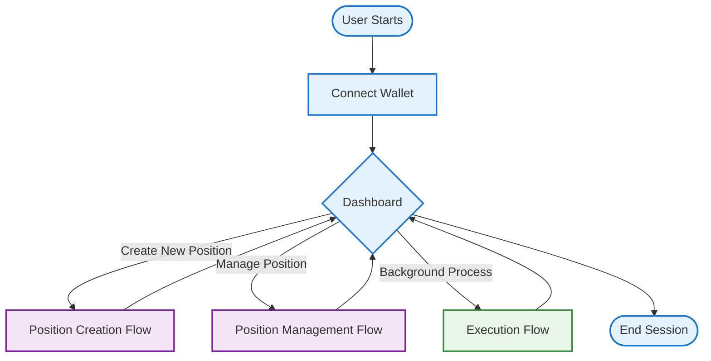
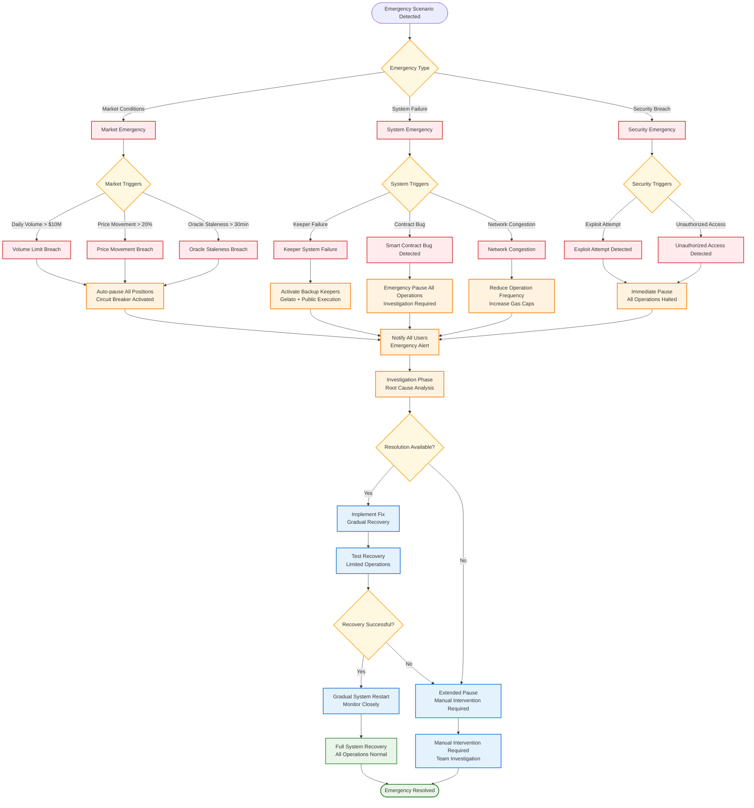

# DCA Crypto User Flow Diagrams

This document provides comprehensive user flow diagrams for the DCA Crypto application, showing the complete user journey from position creation to execution and management.

## User Flow Overview

## Position Creation Flow

```mermaid
flowchart TD
    Start([User Wants to Create Position]) --> Step1["Step 1: Direction & Asset Selection"]
    
    Step1 --> Direction{"Direction Selection"}
    Direction -->|BUY| BuyFlow["BUY: Quote Token → WBTC"]
    Direction -->|SELL| SellFlow["SELL: WBTC → Quote Token"]
    
    BuyFlow --> Amount1["Select Amount per Period<br/>Quote tokens or USD equivalent"]
    SellFlow --> Amount2["Select Amount per Period<br/>WBTC units or USD equivalent"]
    
    Amount1 --> Step2["Step 2: Cadence & Schedule"]
    Amount2 --> Step2
    
    Step2 --> Frequency{"Frequency Selection"}
    Frequency -->|Daily| Daily["Daily Cadence"]
    Frequency -->|Weekly| Weekly["Weekly Cadence"]
    Frequency -->|Monthly| Monthly["Monthly Cadence"]
    
    Daily --> Schedule["Set Start Date/Time UTC<br/>Optional End Date/Time UTC"]
    Weekly --> Schedule
    Monthly --> Schedule
    
    Schedule --> Step3["Step 3: Guards & Protection"]
    
    Step3 --> Slippage["Set Slippage Protection<br/>Default: 0.5% 50bps"]
    Slippage --> PriceGuards{"Price Guards"}
    
    PriceGuards -->|BUY Position| PriceCap["Set Price Cap USD<br/>Maximum BTC price to buy"]
    PriceGuards -->|SELL Position| PriceFloor["Set Price Floor USD<br/>Minimum BTC price to sell"]
    PriceGuards -->|Both| BothGuards["Set Both Price Cap & Floor"]
    
    PriceCap --> DepegGuard["Depeg Guard<br/>1% max deviation from USD peg"]
    PriceFloor --> DepegGuard
    BothGuards --> DepegGuard
    
    DepegGuard --> Step4["Step 4: Routing & MEV Protection"]
    
    Step4 --> Venue{"Venue Selection"}
    Venue -->|AUTO Recommended| AutoRoute["AUTO Routing<br/>Intelligent venue selection<br/>CoW ≥ $5k, UniV3 < $5k"]
    Venue -->|Advanced| ManualVenue["Manual Venue Selection<br/>UNIV3_ONLY / COW_ONLY / AGGREGATOR"]
    
    AutoRoute --> MEVProtection["MEV Protection Mode"]
    ManualVenue --> MEVProtection
    
    MEVProtection --> MEVMode{"MEV Mode"}
    MEVMode -->|PRIVATE Default| Private["PRIVATE Mode<br/>Flashbots integration<br/>MEV protection"]
    MEVMode -->|PUBLIC| Public["PUBLIC Mode<br/>Tight slippage limits<br/>Higher MEV risk"]
    
    Private --> GasCaps["Optional Gas Caps<br/>maxBaseFeeWei<br/>maxPriorityFeeWei"]
    Public --> GasCaps
    
    GasCaps --> Review["Review Position Parameters"]
    Review --> Validate{"Validate Parameters"}
    
    Validate -->|Invalid| Error["Show Validation Errors<br/>Return to Step 1"]
    Validate -->|Valid| Estimate["Estimate Total Cost<br/>Protocol fees + Execution fees"]
    
    Error --> Step1
    Estimate --> ApprovePermit["Approve Permit2 Allowances<br/>Quote token for BUY<br/>WBTC for SELL"]
    
    ApprovePermit --> CreateTx["Sign Position Creation Transaction"]
    CreateTx --> TxPending["Transaction Pending"]
    TxPending --> TxSuccess{"Transaction Success?"}
    
    TxSuccess -->|Failed| TxError["Transaction Failed<br/>Show error message<br/>Retry option"]
    TxSuccess -->|Success| PositionCreated["Position Created Successfully<br/>NFT Minted<br/>Position Storage Initialized"]
    
    TxError --> CreateTx
    PositionCreated --> Dashboard["Return to Dashboard<br/>Position Visible"]
    
    Dashboard --> End([Position Creation Complete])
    
    %% Styling
    classDef step fill:#e3f2fd,stroke:#1976d2,stroke-width:2px
    classDef decision fill:#fff3e0,stroke:#f57c00,stroke-width:2px
    classDef action fill:#e8f5e8,stroke:#388e3c,stroke-width:2px
    classDef error fill:#ffebee,stroke:#d32f2f,stroke-width:2px
    classDef success fill:#e8f5e8,stroke:#2e7d32,stroke-width:2px
    
    class Step1,Step2,Step3,Step4,Review step
    class Direction,Frequency,PriceGuards,Venue,MEVMode,Validate,TxSuccess decision
    class BuyFlow,SellFlow,Amount1,Amount2,Daily,Weekly,Monthly,Schedule,Slippage,PriceCap,PriceFloor,BothGuards,DepegGuard,AutoRoute,ManualVenue,Private,Public,GasCaps,Estimate,ApprovePermit,CreateTx,TxPending action
    class Error,TxError error
    class PositionCreated,Dashboard,End success
```

## Position Management Flow

```mermaid
flowchart TD
    Start([User Selects Position to Manage]) --> PositionView[View Position Details<br/>Status, Next Execution, Balances]
    
    PositionView --> Actions{Available Actions}
    
    %% Deposit/Withdraw Flow
    Actions -->|Deposit Funds| Deposit[Deposit Funds]
    Actions -->|Withdraw Funds| Withdraw[Withdraw Funds]
    Actions -->|Pause Position| Pause[Pause Position]
    Actions -->|Resume Position| Resume[Resume Position]
    Actions -->|Modify Position| Modify[Modify Position]
    Actions -->|Cancel Position| Cancel[Cancel Position]
    Actions -->|Emergency Withdraw| Emergency[Emergency Withdraw]
    Actions -->|Export CSV| Export[Export CSV]
    
    %% Deposit Flow
    Deposit --> DepositToken{Select Token}
    DepositToken -->|Quote Token USDC/DAI/USDT| DepositQuote[Deposit Quote Token]
    DepositToken -->|WBTC| DepositWBTC[Deposit WBTC]
    
    DepositQuote --> DepositAmount[Enter Deposit Amount]
    DepositWBTC --> DepositAmount
    
    DepositAmount --> ApproveDeposit[Approve Token Transfer<br/>Permit2 Supported]
    ApproveDeposit --> ExecuteDeposit[Execute Deposit Transaction]
    ExecuteDeposit --> DepositSuccess[Deposit Successful<br/>Balance Updated]
    
    %% Withdraw Flow
    Withdraw --> WithdrawToken{Select Token to Withdraw}
    WithdrawToken -->|Quote Token| WithdrawQuote[Withdraw Quote Token]
    WithdrawToken -->|WBTC| WithdrawWBTC[Withdraw WBTC]
    
    WithdrawQuote --> WithdrawAmount[Enter Withdraw Amount<br/>Show Available Balance]
    WithdrawWBTC --> WithdrawAmount
    
    WithdrawAmount --> WithdrawAddress[Enter Withdraw Address<br/>Default: Position Owner]
    WithdrawAddress --> ExecuteWithdraw[Execute Withdraw Transaction]
    ExecuteWithdraw --> WithdrawSuccess[Withdraw Successful<br/>Balance Updated]
    
    %% Pause/Resume Flow
    Pause --> PauseConfirm[Confirm Pause Action<br/>No more executions scheduled]
    PauseConfirm --> ExecutePause[Execute Pause Transaction]
    ExecutePause --> PauseSuccess[Position Paused<br/>Execution Halted]
    
    Resume --> ResumeConfirm[Confirm Resume Action<br/>Next execution scheduled]
    ResumeConfirm --> ExecuteResume[Execute Resume Transaction]
    ExecuteResume --> ResumeSuccess[Position Resumed<br/>Execution Active]
    
    %% Modify Flow
    Modify --> ModifyFields[Select Fields to Modify<br/>Safe fields only]
    ModifyFields --> ModifyOptions{Modification Options}
    ModifyOptions -->|Slippage| ModifySlippage[Modify Slippage Protection]
    ModifyOptions -->|Venue| ModifyVenue[Modify Routing Venue]
    ModifyOptions -->|Gas Caps| ModifyGas[Modify Gas Price Caps]
    ModifyOptions -->|Guards| ModifyGuards[Modify Price Guards]
    ModifyOptions -->|Beneficiary| ModifyBeneficiary[Modify Beneficiary Address]
    
    ModifySlippage --> ValidateModify[Validate Modifications]
    ModifyVenue --> ValidateModify
    ModifyGas --> ValidateModify
    ModifyGuards --> ValidateModify
    ModifyBeneficiary --> ValidateModify
    
    ValidateModify --> ExecuteModify[Execute Modify Transaction]
    ExecuteModify --> ModifySuccess[Position Modified<br/>Changes Applied]
    
    %% Cancel Flow
    Cancel --> CancelConfirm[Confirm Cancel Action<br/>No more executions<br/>Withdraw remaining funds]
    CancelConfirm --> ExecuteCancel[Execute Cancel Transaction]
    ExecuteCancel --> CancelSuccess[Position Canceled<br/>Funds Available for Withdrawal]
    
    %% Emergency Withdraw Flow
    Emergency --> EmergencyCheck{Emergency Conditions Met?}
    EmergencyCheck -->|No| EmergencyBlocked[Emergency Withdraw Blocked<br/>Position not paused for 7+ days<br/>or has recent executions]
    EmergencyCheck -->|Yes| EmergencyConfirm[Confirm Emergency Withdraw<br/>7-day delay period<br/>Full position recovery]
    
    EmergencyBlocked --> PositionView
    EmergencyConfirm --> EmergencyDelay[Emergency Withdraw Initiated<br/>7-day delay countdown]
    EmergencyDelay --> ExecuteEmergency[Execute Emergency Withdraw<br/>After 7-day delay]
    ExecuteEmergency --> EmergencySuccess[Emergency Withdraw Complete<br/>All funds recovered]
    
    %% Export Flow
    Export --> ExportFormat[Select Export Format<br/>CSV with transaction history]
    ExportFormat --> GenerateExport[Generate Export File<br/>Include execution details, fees, routes]
    GenerateExport --> DownloadExport[Download CSV File<br/>Ready for tax reporting]
    
    %% Return to Dashboard
    DepositSuccess --> PositionView
    WithdrawSuccess --> PositionView
    PauseSuccess --> PositionView
    ResumeSuccess --> PositionView
    ModifySuccess --> PositionView
    CancelSuccess --> PositionView
    EmergencySuccess --> PositionView
    DownloadExport --> PositionView
    
    PositionView --> Dashboard[Return to Dashboard]
    Dashboard --> End([Management Complete])
    
    %% Styling
    classDef action fill:#e3f2fd,stroke:#1976d2,stroke-width:2px
    classDef decision fill:#fff3e0,stroke:#f57c00,stroke-width:2px
    classDef process fill:#e8f5e8,stroke:#388e3c,stroke-width:2px
    classDef error fill:#ffebee,stroke:#d32f2f,stroke-width:2px
    classDef success fill:#e8f5e8,stroke:#2e7d32,stroke-width:2px
    classDef warning fill:#fff8e1,stroke:#f9a825,stroke-width:2px
    
    class PositionView,Deposit,Withdraw,Pause,Resume,Modify,Cancel,Emergency,Export action
    class Actions,DepositToken,WithdrawToken,ModifyOptions,EmergencyCheck decision
    class DepositQuote,DepositWBTC,DepositAmount,ApproveDeposit,ExecuteDeposit,WithdrawQuote,WithdrawWBTC,WithdrawAmount,WithdrawAddress,ExecuteWithdraw,PauseConfirm,ExecutePause,ResumeConfirm,ExecuteResume,ModifyFields,ModifySlippage,ModifyVenue,ModifyGas,ModifyGuards,ModifyBeneficiary,ValidateModify,ExecuteModify,CancelConfirm,ExecuteCancel,EmergencyConfirm,EmergencyDelay,ExecuteEmergency,ExportFormat,GenerateExport,DownloadExport process
    class EmergencyBlocked error
    class DepositSuccess,WithdrawSuccess,PauseSuccess,ResumeSuccess,ModifySuccess,CancelSuccess,EmergencySuccess,Dashboard,End success
    class EmergencyDelay warning
```

## Execution Flow (Background Process)

```mermaid
flowchart TD
    Start([Keeper Trigger]) --> CheckUpkeep[Chainlink checkUpkeep]
    
    CheckUpkeep --> EligiblePositions[Get Eligible Positions<br/>Time-based + not paused]
    EligiblePositions --> BatchProcess[Batch Process Positions<br/>Gas optimization]
    
    BatchProcess --> PositionLoop[For Each Position]
    PositionLoop --> ValidateGuards[Validate All Guards]
    
    ValidateGuards --> OracleCheck[Oracle Staleness Check<br/>≤ 30 minutes]
    OracleCheck --> TWAPCheck[TWAP Window Check<br/>≥ twapWindow default 1h]
    TWAPCheck --> DeviationCheck[Price Deviation Check<br/>DEX vs TWAP vs Oracle]
    DeviationCheck --> DepegCheck[Stable Depeg Check<br/>≤ 1% deviation from USD]
    DepegCheck --> PriceGuardCheck[Price Cap/Floor Check<br/>BUY: ≤ priceCapUsd<br/>SELL: ≥ priceFloorUsd]
    PriceGuardCheck --> GasCheck[Gas Price Check<br/>≤ position gas caps]
    
    GasCheck --> GuardsPass{All Guards Pass?}
    GuardsPass -->|No| SkipExecution[Skip Execution<br/>Emit ExecutionSkipped<br/>No schedule advance]
    GuardsPass -->|Yes| SelectRoute[Select Optimal Route]
    
    SelectRoute --> RouteLogic{Routing Logic}
    RouteLogic -->|≥ $5k or High Slippage| CoWRoute[CoW Protocol Route<br/>Partial fills allowed<br/>MEV protection]
    RouteLogic -->|< $5k and Low Slippage| UniV3Route[Uniswap V3 Route<br/>Private transaction<br/>Flashbots integration]
    RouteLogic -->|Fallback| OneInchRoute[1inch Aggregator Route<br/>Multi-DEX routing<br/>Optimal pathfinding]
    
    CoWRoute --> ExecuteCoW[Execute CoW Trade]
    UniV3Route --> ExecuteUniV3[Execute UniV3 Trade]
    OneInchRoute --> ExecuteOneInch[Execute 1inch Trade]
    
    ExecuteCoW --> TradeSuccess{Trade Success?}
    ExecuteUniV3 --> TradeSuccess
    ExecuteOneInch --> TradeSuccess
    
    TradeSuccess -->|Failed| FallbackRoute{Fallback Available?}
    TradeSuccess -->|Success| UpdateAccounting[Update Accounting]
    
    FallbackRoute -->|Yes| TryFallback[Try Next Route<br/>CoW → UniV3 → 1inch]
    FallbackRoute -->|No| SkipExecution
    
    TryFallback --> TradeSuccess
    
    UpdateAccounting --> CalculateFees[Calculate Fees<br/>Protocol fee: notional × feeBps<br/>Execution fee: fixed + premium]
    CalculateFees --> DeductFees[Deduct Fees from Position]
    DeductFees --> UpdateBalances[Update Position Balances<br/>BUY: credit WBTC<br/>SELL: credit quote token]
    UpdateBalances --> ScheduleNext[Schedule Next Execution<br/>nextExecAt = nextScheduled<br/>periodsExec++]
    
    ScheduleNext --> EmitEvents[Emit Events<br/>Executed, ExecutionDetails<br/>Route, price impact, gas used]
    EmitEvents --> CheckEnd{End Date Reached?}
    
    CheckEnd -->|Yes| AutoPause[Auto-pause Position<br/>End of strategy]
    CheckEnd -->|No| PositionComplete[Position Execution Complete]
    
    SkipExecution --> PositionComplete
    AutoPause --> PositionComplete
    PositionComplete --> NextPosition{More Positions?}
    
    NextPosition -->|Yes| PositionLoop
    NextPosition -->|No| ExecutionComplete[Batch Execution Complete<br/>Update keeper metrics]
    
    ExecutionComplete --> NotifyUsers[Notify Users<br/>Push notifications<br/>Email alerts]
    NotifyUsers --> UpdateSubgraph[Update Subgraph<br/>Index new events<br/>Real-time data]
    UpdateSubgraph --> End([Execution Cycle Complete])
    
    %% Styling
    classDef keeper fill:#e8f5e8,stroke:#388e3c,stroke-width:2px
    classDef validation fill:#fff3e0,stroke:#f57c00,stroke-width:2px
    classDef routing fill:#e3f2fd,stroke:#1976d2,stroke-width:2px
    classDef execution fill:#f3e5f5,stroke:#7b1fa2,stroke-width:2px
    classDef accounting fill:#fce4ec,stroke:#c2185b,stroke-width:2px
    classDef decision fill:#fff8e1,stroke:#f9a825,stroke-width:2px
    classDef success fill:#e8f5e8,stroke:#2e7d32,stroke-width:2px
    classDef error fill:#ffebee,stroke:#d32f2f,stroke-width:2px
    
    class CheckUpkeep,EligiblePositions,BatchProcess,PositionLoop,ExecutionComplete keeper
    class ValidateGuards,OracleCheck,TWAPCheck,DeviationCheck,DepegCheck,PriceGuardCheck,GasCheck validation
    class SelectRoute,RouteLogic,CoWRoute,UniV3Route,OneInchRoute routing
    class ExecuteCoW,ExecuteUniV3,ExecuteOneInch execution
    class UpdateAccounting,CalculateFees,DeductFees,UpdateBalances,ScheduleNext accounting
    class GuardsPass,TradeSuccess,FallbackRoute,CheckEnd,NextPosition decision
    class EmitEvents,PositionComplete,NotifyUsers,UpdateSubgraph,End success
    class SkipExecution,TryFallback error
```

## Emergency Scenarios Flow

## User Flow Components

### 1. Position Creation Flow

The position creation flow is a 4-step wizard that guides users through:

1. **Direction & Asset Selection**: Choose BUY (quote→WBTC) or SELL (WBTC→quote) with amount specification
2. **Cadence & Schedule**: Select frequency (daily/weekly/monthly) and set start/end times
3. **Guards & Protection**: Configure slippage, price caps/floors, and depeg protection
4. **Routing & MEV Protection**: Choose venue (AUTO recommended) and MEV protection mode

Key features:
- **Permit2 Integration**: Gasless approvals for better UX
- **Cost Estimation**: Real-time fee and cost calculations
- **Validation**: Comprehensive parameter validation before transaction
- **NFT Minting**: Position represented as ERC-721 token

### 2. Position Management Flow

Users can manage existing positions through multiple actions:

- **Deposit/Withdraw**: Add or remove funds anytime (except during execution)
- **Pause/Resume**: Temporarily halt or restart position execution
- **Modify**: Update safe parameters (slippage, venue, gas caps, guards, beneficiary)
- **Cancel**: Permanently stop execution and withdraw remaining funds
- **Emergency Withdraw**: Time-delayed recovery mechanism (7-day delay)
- **Export**: Generate CSV reports for tax reporting

Key features:
- **Safe Modifications**: Only non-critical parameters can be modified
- **Emergency Protection**: 7-day delayed emergency withdrawal for stuck positions
- **Real-time Balances**: Live updates of position balances and execution status

### 3. Execution Flow (Background)

The execution flow runs automatically via keeper infrastructure:

1. **Eligibility Check**: Time-based and status validation
2. **Guard Validation**: Comprehensive safety checks (oracle, TWAP, price, gas)
3. **Route Selection**: Intelligent venue selection based on notional and conditions
4. **Trade Execution**: MEV-protected execution with fallback mechanisms
5. **Accounting**: Fee calculation, balance updates, and next execution scheduling
6. **Notifications**: User alerts and subgraph updates

Key features:
- **Multi-tier Routing**: CoW → UniV3 → 1inch cascade with fallbacks
- **MEV Protection**: Flashbots integration for private transactions
- **Batch Processing**: Gas-optimized batch execution
- **Circuit Breakers**: Automatic pausing on extreme conditions

### 4. Emergency Scenarios

The system includes comprehensive emergency handling:

- **Market Emergencies**: Volume limits, price movements, oracle staleness
- **System Emergencies**: Keeper failures, contract bugs, network issues
- **Security Emergencies**: Exploit attempts, unauthorized access

Emergency response includes automatic pausing, user notifications, investigation phases, and gradual recovery procedures.

## Integration Points

### Frontend Integration
- **Wallet Connection**: RainbowKit with WalletConnect v2 support
- **Real-time Updates**: WebSocket connections for live position updates
- **Transaction Status**: Optimistic UI with proper error handling
- **Notifications**: Push Protocol integration for execution alerts

### Backend Integration
- **The Graph**: Subgraph for historical data and analytics
- **Chainlink Automation**: Primary keeper infrastructure
- **Gelato Network**: Backup keeper services
- **Monitoring**: Sentry for error tracking, PostHog for analytics

This comprehensive user flow design ensures a smooth, secure, and user-friendly experience for DCA Crypto operations while maintaining the highest security standards and MEV protection.
